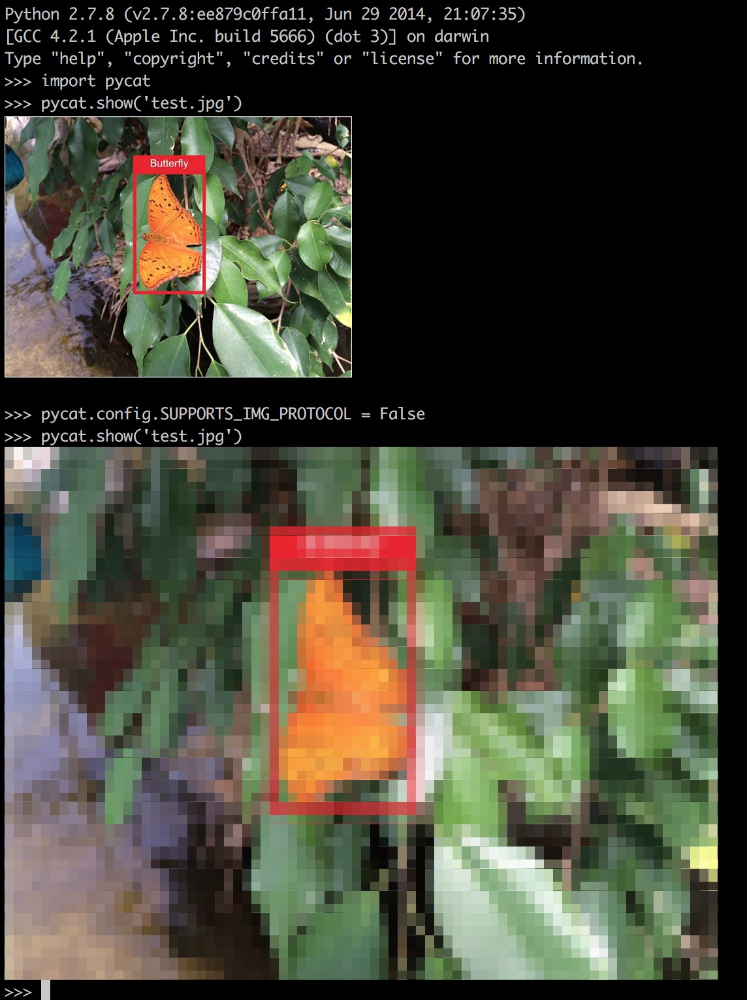

## pycat
Something like print, but for images...

    pip install pycat-real
    
**Note: your terminal must support the image protocol if you want to see high resolution images.**
An good example of a terminal supporting image protocol is iTerm 2. If your don't want to use image protocol just set: `pycat.config.SUPPORTS_IMG_PROTOCOL = False` and pycat will generate the image using tiny colored symbols mimicking pixels. If your terminal does not support true colors you may also have to set: `pycat.config.SUPPORTS_TRUE_COLORS = False` :) 

